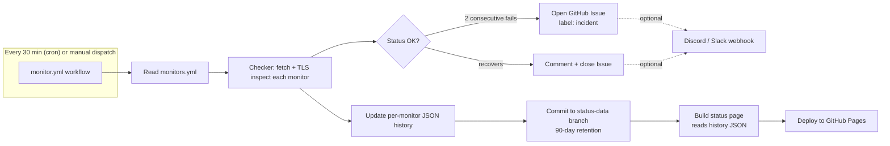

# uptime-monitor

Serverless uptime monitoring that runs entirely on GitHub Actions — no server, no database, no paid tier. It checks your endpoints every 30 minutes, keeps 90 days of history on a dedicated branch, opens/closes GitHub Issues for incidents, and publishes a static status page to GitHub Pages.

**Live status page:** https://adriasancheza.github.io/uptime-monitor/

[](https://github.com/adriasancheza/uptime-monitor/actions/workflows/monitor.yml)
[](https://github.com/adriasancheza/uptime-monitor/actions/workflows/ci.yml)
[](LICENSE)

## How it works



1. **`monitor.yml`** runs on a `*/30 * * * *` cron (and on demand via `workflow_dispatch`).
2. It reads `monitors.yml`, and for each entry performs an HTTP request with `fetch`, measuring response time, status code, and (for HTTPS) TLS certificate days-to-expiry via `node:tls`.
3. Results are folded into a per-monitor JSON history file (daily aggregates, 90-day retention) committed to the **`status-data`** branch — keeping history data out of `main`.
4. Two consecutive failures open a GitHub Issue labelled `incident`; the next successful check closes it with a recovery comment. Optional Discord/Slack webhooks can also be notified.
5. The workflow then builds the static status page (Vite + vanilla TypeScript) from the updated history and deploys it to GitHub Pages.

## Fork and use it in 3 steps

1. **Fork this repository** and edit [`monitors.yml`](monitors.yml) with the endpoints you want to watch:

   ```yaml
   monitors:
     - name: My Website
       url: https://example.com
       expectedStatus: 200
       timeoutMs: 10000
       keyword: 'Welcome' # optional: substring that must be in the response body
   ```

2. **Enable GitHub Pages** for your fork: _Settings → Pages → Build and deployment → Source: **GitHub Actions**_.

3. **Enable workflow write permissions** (needed to commit history and open/close issues): _Settings → Actions → General → Workflow permissions → **Read and write permissions**_.

That's it — the `monitor.yml` workflow will start running every 30 minutes (or trigger it immediately from the _Actions_ tab with _Run workflow_), and your status page will appear at `https://<your-username>.github.io/<repo-name>/`.

### Optional: chat notifications

To get a message posted when a monitor goes down or recovers, add a repository secret with an incoming webhook URL:

- `DISCORD_WEBHOOK_URL` — a [Discord incoming webhook](https://support.discord.com/hc/en-us/articles/228383668-Intro-to-Webhooks) URL.
- `SLACK_WEBHOOK_URL` — a [Slack incoming webhook](https://api.slack.com/messaging/webhooks) URL.

Both are optional; if neither secret is set, notifications are simply skipped.

## Config reference (`monitors.yml`)

| Field            | Required | Default | Description                                            |
| ---------------- | -------- | ------- | ------------------------------------------------------ |
| `name`           | yes      | —       | Display name on the status page and in issues.         |
| `url`            | yes      | —       | URL to request.                                        |
| `method`         | no       | `GET`   | HTTP method.                                           |
| `expectedStatus` | no       | `200`   | HTTP status code considered a success.                 |
| `timeoutMs`      | no       | `10000` | Request timeout in milliseconds.                       |
| `keyword`        | no       | —       | If set, the response body must contain this substring. |

## Project layout

```
monitors.yml                 # endpoints to watch
src/checker/                 # HTTP + TLS check logic, config loading
src/aggregate/                # daily aggregation, 90-day retention, incident state machine
src/scripts/                 # entrypoints: run-checks (writes history), build-site-data (site JSON), GitHub Issues + webhooks
src/site/                     # static status page (Vite + vanilla TypeScript)
test/                         # Vitest unit tests for the above
.github/workflows/monitor.yml # scheduled checker + Pages deploy
.github/workflows/ci.yml      # lint, test, build on PRs/pushes
```

History lives on the **`status-data`** git branch (one JSON file per monitor, plus a generated `index.json`), never on `main`, so the app's commit history stays clean and reviewable.

## Local development

Requires Node.js 22+.

```bash
npm install
npm run check       # run the checker once against monitors.yml, writes to ./data
npm run build:data  # turn ./data into public/data/index.json for the site
npm run dev          # start the status page locally
npm test             # run the Vitest suite
npm run lint          # ESLint
npm run format:check  # Prettier
npm run build         # production build (data + site) into ./dist
```

## License

[MIT](LICENSE) © 2026 Adrià Sánchez
